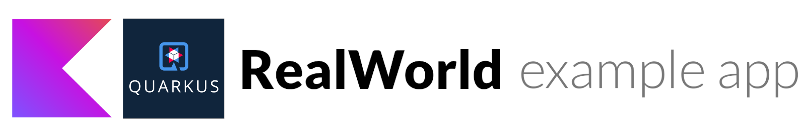

# 

> ### Example of a Kotlin-based Quarkus application containing real world examples (CRUD, auth, advanced patterns, etc) that adheres to the RealWorld API spec.

This codebase was created to demonstrate a fully fledged fullstack application built with [Quarkus](https://quarkus.io/)
including RESTful services, CRUD operations, authentication, routing, pagination, and more.

We've gone to great lengths to adhere to the Quarkus community styleguides & best practices.

For more information on how to this works with other frontends/backends, head over to
the [RealWorld](https://github.com/gothinkster/realworld) repo.

## Contributions

Feedback, suggestions, and improvements are welcome, feel free to contribute.

___
